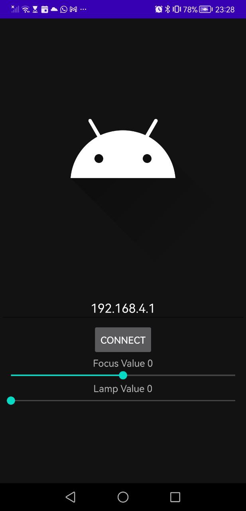

# Android APP for the Anglerfish/Matchboxscope

This is a simple app that displays the stream outside of chrome. Please flash the following firmware and connect to the device using the specifci IP address. If you use the ESP32 camera as an access point it will be 192.168.4.1

You can go here and flash the firmware (advanced server or for the XIAO sense) https://matchboxscope.github.io/firmware/FLASH.html

 
## TODO

- Record Image Stream to disk (cellphone)
- Snap image to disk 
- Set Anglerfishmode
- Set Timelapse period
- Add more endpoints such as manual exposure time/gain 
- Ask for values from `/status` and update gui
-  